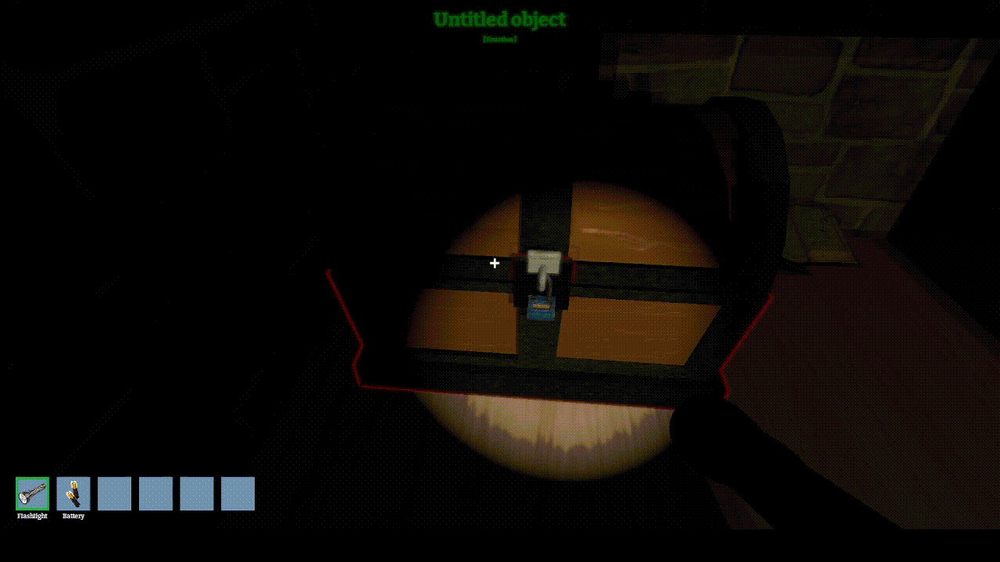
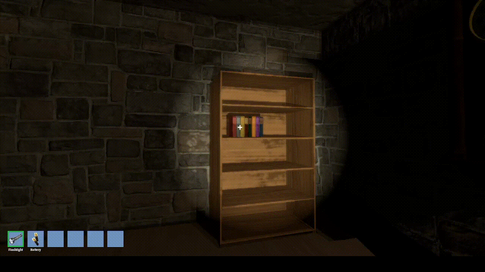
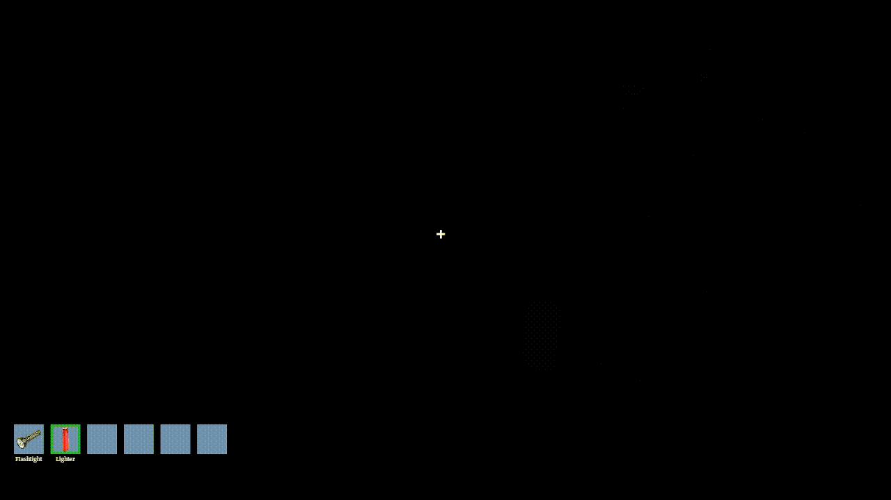

# Custom 3D Game Engine (OpenGL/C++)

A custom 3D game engine and first-person horror demonstration developed from scratch using C++17 and OpenGL 3.3. The project focuses on implementing a low-level graphics pipeline, physics, and game logic without relying on pre-made engines.


---

## Gameplay Preview

<p align="center">
  
  &emsp;
  
  &emsp;
  
</p>

---

## Quick Start (Pre-built)

A compiled version of the engine is available for immediate testing.
1. Download **`Release_Build.zip`** from the **Releases** tab.
2. Extract the archive.
3. Run `Grafika3DProjekt.exe`.
   *(Note: Ensure all `.dll` files and the `Assets` folder are in the same directory as the executable).*

---

## Documentation
Full code documentation is available here: **[View Documentation](https://kamiljop.github.io/Grafika3DProjekt/)**

---

## Technical Features

### Rendering Pipeline
* **Post-Processing Stack:**
  * **HDR (High Dynamic Range):** Floating-point framebuffers with exposure tone mapping.
  * **Bloom:** Two-pass Gaussian blur using ping-pong framebuffers.
  * **Gamma Correction:** Linear lighting pipeline.
* **Lighting & Shadows:**
  * **Omni-directional Shadow Mapping:** Point lights render depth to Cubemaps using Geometry Shaders.
  * **Directional Shadows:** Orthographic projection shadow mapping for global light sources.
  * **Dynamic Lighting:** Blinn-Phong model supporting point lights, directional lights, and spotlights (flashlight) with attenuation.
* **Surface Detail:**
  * **Parallax Mapping:** Steep Parallax Mapping implementation for depth simulation.
  * **Normal Mapping:** Tangent-space lighting calculations.
* **Visual Effects:**
  * **Particle System:** Billboard-based particle rendering with transparency and lifecycle management (used for fire).
  * **Stencil Outline:** Object highlighting mechanism using Stencil Buffer operations.

### Engine Systems
* **Physics & Collision:** Custom AABB (Axis-Aligned Bounding Box) collision detection with dynamic recalculation for moving entities.
* **Audio Engine:** Integration of **SoLoud** library handling 3D spatial audio, attenuation, and multi-channel sound management.
* **Interaction System:** Raycasting-based detection for interactive objects, items, and puzzles.
* **Game Logic:**
  * Multi-stage interaction states (e.g., Radio repair sequence).
  * Logic puzzles (Rotating cylinder locks, Pedestal item verification).
* **GUI & Tools:**
  * Custom 2D rendering subsystem (Text via FreeType & Sprites).
  * Debug menus and options via **Dear ImGui**.
  * Configuration Manager (Singleton) for serializing settings to `config.txt`.

---

## Controls

| Input | Action |
| :--- | :--- |
| **W, A, S, D** | Movement |
| **Mouse** | Camera Control |
| **Space** | Jump |
| **L-Shift** | Crouch |
| **F** | Flashlight Toggle |
| **E** | Interact / Pick Up |
| **1-6 / Scroll** | Inventory Selection |
| **Q / E** | Puzzle Manipulation (Rotate Left/Right) |
| **ESC** | Pause / Settings Menu |

---

## Build Instructions

This project is configured for **Visual Studio 2019/2022**.

### Dependencies
The following libraries are required to build from source. Ensure headers and binaries (`.lib`, `.dll`) are linked correctly.

* **GLFW** (Windowing & Input)
* **GLAD** (OpenGL Loader Generator)
* **GLM** (OpenGL Mathematics)
* **Assimp** (Open Asset Import Library)
* **FreeType** (Font Rendering)
* **SoLoud** (Audio Engine)
* **Dear ImGui** (Immediate Mode GUI)

### Compilation Steps
1.  Open the solution file (`.sln`) in Visual Studio.
2.  Navigate to **Project Properties**:
    * **C/C++ > General > Additional Include Directories**: Add paths to `include/` folders for all dependencies.
    * **Linker > General > Additional Library Directories**: Add paths to `lib/` folders.
    * **Linker > Input**: Ensure the following are listed:
        `opengl32.lib`, `glfw3.lib`, `assimp-vc143-mt.lib`, `freetype.lib`, `soloud.lib`.
3.  Build the solution (Target: **Release x64** recommended).
4.  **Crucial Step:** Copy the `Shaders`, `Models`, `Textures`, `Audio`, and `Fonts` directories to the output folder (where the `.exe` is generated).

---

## Project Structure

```text
├── src/
│   ├── Core/           # Window, Camera, Config, Input handling
│   ├── Entities/       # Game objects, Player, Physics logic
│   ├── Rendering/      # Shader, Model, Mesh, Lighting classes
│   ├── Systems/        # Audio, Particles, GUI implementations
│   └── main.cpp        # Entry point and Game Loop
├── Shaders/            # GLSL Source Code (.vert, .frag, .geom)
├── Models/             # Models (.obj, .mtl)
├── Textures/           # Textures (.png, .jpg)     
├── Audio/              # Audio sources         
└── Fonts/              # Fonts
          
```

## Contributors

* **Kamil Jop**
* **Maciej Mika**
* **Jakub Jurczyk**

---

## License
This project is licensed under the MIT License.